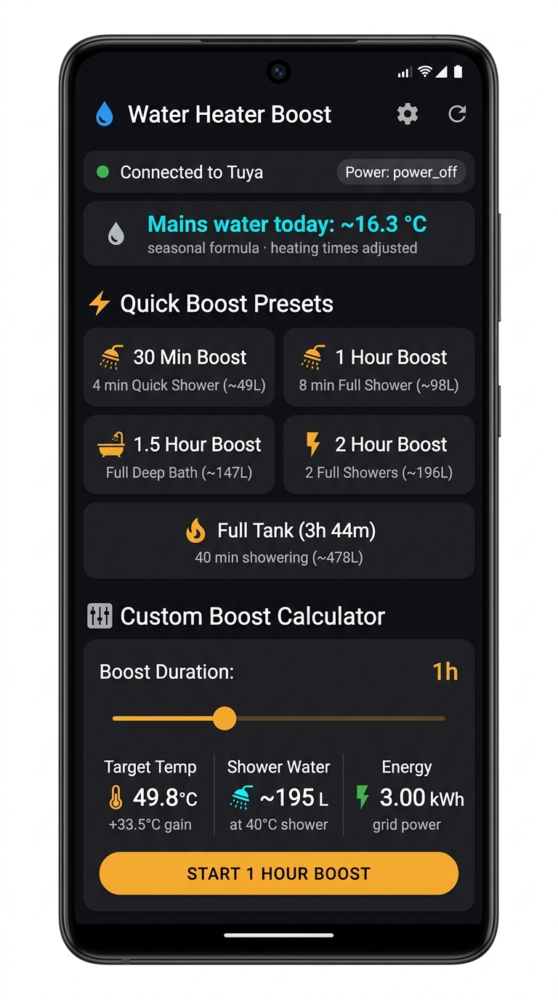
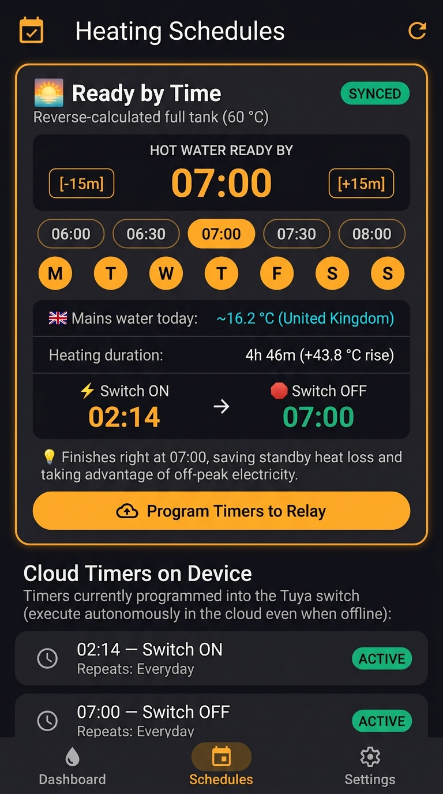

# 💧 Smart Water Heater Controller (Android)

An Android app to remotely control an immersion water heater via the **[Timeguard FSTWIFI Wi-Fi Controlled Fused Spur Timeswitch](https://www.timeguard.com/products/time-switches/fstwifi/)** — a Tuya-based smart wall socket widely used in the UK for immersion heaters and storage heaters. Calculates the optimal heating duration based on a seasonal mains water temperature model calibrated for UK distribution systems, with no external sensors or APIs required.

## Features

- **Remote control** — turn the heater on/off with configurable countdown timers via the Tuya OpenAPI
- **Thermal model** — calculates how long to heat based on target temperature, tank size, and element rating
- **Seasonal inlet temperature** — uses a calibrated sine-wave formula to estimate incoming cold water temperature by day-of-year across 9 regions (no sensor needed)
- **"Ready by [Time]" automated schedule** — backwards-calculates exact switch-on time from your target ready time (e.g. 07:00 AM) and programs autonomous hardware timers into Tuya Cloud
- **Quick presets** — 30 min, 1h, 1.5h, 2h, and Full Tank boosts dynamically adjusted to the season
- **Custom slider** — dial in exact duration with live energy (kWh) and shower-water estimates
- **Legionella-safe defaults** — 60 °C target temperature by default

## Screenshots

<p align="center">
  &nbsp;&nbsp;&nbsp;&nbsp;
  
</p>

*Left: The dashboard shows today's estimated mains water temperature (seasonal formula), quick boost presets dynamically adjusted to the season, and the custom boost calculator with live energy and shower-water estimates.*
*Right: The Heating Schedules screen featuring the 'Ready by Time' scheduler, which reverse-calculates the switch-on time to achieve a full 60 °C tank right when needed, and syncs autonomous cloud timers directly to the relay.*

---

## Tested Hardware

This app was built and tested in the UK with the **Timeguard FSTWIFI Wi-Fi Controlled Fused Spur Timeswitch**:

- **Model:** `WIFIRELYAY` (Tuya product category: `kg`)
- **Fused spur output:** 13 A — suitable for immersion heaters up to 3 kW
- **Protocol:** Tuya Smart / Local Key (firmware 3.3 / 3.4)
- **Commands used:** `switch_1` (on/off), `countdown_1` (0–86400 s timer)
- **UK-specific:** Designed for standard UK unvented and vented hot water cylinders

Any other Tuya-compatible relay or smart switch with `switch_1` and `countdown_1` datapoints should also work — just update `TUYA_WATER_TANK_DEVICE_ID` in `local.properties`.

---

## Setup

### Prerequisites

- Docker Desktop (for building — no local Java/Gradle/Android SDK needed)
- A Tuya IoT account with a Cloud Project and a Wi-Fi relay device

### 1. Clone the repo

```bash
git clone https://github.com/markmclaren/tuya-water-heater-app.git
cd tuya-water-heater-app
```

### 2. Configure credentials

Copy the example file and fill in your own values:

```bash
cp local.properties.example local.properties
```

Edit `local.properties`:

```properties
TUYA_CLIENT_ID=your_client_id_here
TUYA_CLIENT_SECRET=your_client_secret_here
TUYA_REGION_URL=https://openapi.tuyaeu.com
TUYA_WATER_TANK_DEVICE_ID=your_device_id_here
```

**Where to find these values:**

| Value | Where to find it |
|---|---|
| `TUYA_CLIENT_ID` | [iot.tuya.com](https://iot.tuya.com) → Cloud → Your Project → Overview |
| `TUYA_CLIENT_SECRET` | Same page, hidden by default |
| `TUYA_WATER_TANK_DEVICE_ID` | Tuya Console → Devices tab, or run `python -m tinytuya wizard` |
| `TUYA_REGION_URL` | `https://openapi.tuyaeu.com` (EU), `https://openapi.tuyaus.com` (US), etc. |

> ⚠️ **`local.properties` is in `.gitignore` and will never be committed.** It is only used at build time to inject secrets via Gradle `buildConfigField`.

### 3. Build the APK

```bash
./build_with_docker.sh
```

This builds a debug APK at `app-debug.apk` with no local Java/Gradle/Android SDK required.

### 4. Install on your phone

Send `app-debug.apk` to yourself (WhatsApp, email, or Google Drive) and tap to install. You may need to enable **Install from unknown sources** in Android Settings.

---

## Project Structure

```
tuya-water-heater-app/
├── app/src/main/java/com/example/waterheater/
│   ├── data/
│   │   ├── TuyaApiClient.kt        # HMAC-SHA256 Tuya OpenAPI client
│   │   ├── ThermalModel.kt         # Heating physics + UKWIR seasonal model
│   │   └── WaterHeaterRepository.kt
│   ├── ui/
│   │   ├── WaterHeaterViewModel.kt
│   │   └── screens/
│   │       ├── HomeScreen.kt       # Main dashboard
│   │       ├── SchedulesScreen.kt
│   │       ├── SettingsScreen.kt
│   │       └── RelayStatusScreen.kt
│   └── MainActivity.kt
├── local.properties.example        # ← copy this to local.properties
├── .env.example                    # ← copy this to .env (for test_app_logic.py)
├── build_with_docker.sh            # Docker build script
├── Dockerfile
└── test_app_logic.py               # Physics + HMAC-SHA256 unit tests
```

## Seasonal Water Temperature Model

Incoming mains water temperature varies throughout the year due to seasonal ground temperature cycles at typical water pipe burial depths. The app uses an empirical sine-wave model:

```
T_mains = mean + amplitude × sin(2π × (day_of_year − phase_day) / 365)
```

The heating duration for all presets adjusts automatically every day — so the "Full Tank" preset takes longer in February than in August. No temperature sensor or internet connection required.

### Supported Regional Profiles

The app **defaults to the United Kingdom 🇬🇧**, but you can select your region in **Settings → Tank Physics** (marked with national flags):

| Flag | Region | Annual Mean | Seasonal Swing | Burial Depth | Data Source / Reference |
|---|---|---|---|---|---|
| 🇬🇧 | **United Kingdom (Default)** | 11.5 °C | ±7.5 °C (4–19 °C) | ~750 mm | [UKWIR](https://ukwir.org/) Report 09/WM/03/14 (*"Cold water temperatures in UK distribution systems"*) |
| 🇮🇪 | **Ireland** | 11.0 °C | ±6.5 °C (4.5–17.5 °C) | ~600 mm | Met Éireann & Geological Survey Ireland soil temperature studies |
| 🇫🇷 | **France (North)** | 12.5 °C | ±8.0 °C (4.5–20.5 °C) | ~800 mm | BRGM French ground temperature atlas |
| 🇩🇪 | **Germany** | 10.0 °C | ±9.5 °C (0.5–19.5 °C) | ~800 mm | DVGW W551 & DIN 4708 (*"Trinkwassererwärmungsanlagen"*) |
| 🇳🇱 | **Netherlands** | 11.0 °C | ±7.0 °C (4–18 °C) | ~700 mm | RIVM & KWR Watercycle Research Institute |
| 🇪🇸 | **Spain (North)** | 14.0 °C | ±7.0 °C (7–21 °C) | ~600 mm | IGN Spanish ground temperature atlas |
| 🇺🇸 | **USA (North-East)** | 10.0 °C | ±10.0 °C (0–20 °C) | ~900 mm | ASHRAE 2009 Handbook of Fundamentals, Ch. 18 / EPA WaterSense |
| 🇺🇸 | **USA (Pacific NW)** | 11.0 °C | ±6.0 °C (5–17 °C) | ~750 mm | ASHRAE 2009 Handbook of Fundamentals, Ch. 18 / EPA WaterSense |
| 🇦🇺 | **Australia (South-East)** | 16.0 °C | ±6.0 °C (10–22 °C) | ~500 mm | CSIRO & Bureau of Meteorology (Southern hemisphere inverted season) |
| 🌍 | **Custom** | User-defined | User-defined | Custom | Manual configuration of annual mean, seasonal swing, and phase day |

> **ℹ️ Shower duration assumptions**
> The preset labels (e.g. *"4 min Quick Shower"*) assume a **power shower at ~12 litres/minute**. If you have a gravity-fed or standard mixer shower (~8 L/min), the same volume of hot water will last proportionally longer — multiply the quoted minutes by ~1.5 as a rough guide.

---

## 🌅 "Ready by [Time]" Automated Morning Heating

Instead of manually guessing when to switch the immersion heater on before waking up, the **Schedules** tab provides an automated **Ready by Time** feature:

1. **Set your target:** Choose when you need hot water (e.g. `07:00 AM`) and which days to repeat (`Everyday`, `Weekdays`, etc.).
2. **Reverse seasonal calculation:** The app determines the exact switch-on time by subtracting the seasonal heating duration needed to bring your tank to 60 °C:
   - **Summer (~16 °C inlet):** Starts heating at **~02:15 AM** (for a standard 266 L tank) or **~04:20 AM** (for a 150 L tank).
   - **Winter (~4 °C inlet):** Starts heating earlier at **~00:55 AM** (for a 266 L tank) or **~03:20 AM** (for a 150 L tank).
3. **One-tap cloud programming:** Tap **Program Timers to Relay** to write the paired `Turn ON` and `Turn OFF` timers directly to Tuya Cloud.

### Autonomous Cloud Execution & Seasonal Re-Sync Cadence

- **Fully Autonomous:** Once programmed, Tuya Cloud executes the timers reliably every day directly on your switch, even if your phone is turned off, in airplane mode, or out of battery.
- **Seasonal Cadence:** Ground water temperature shifts very slowly (~0.05 °C per day, amounting to only ~1–2 minutes of heating variation per week). You **only need to re-sync the schedule seasonally** (e.g., in Spring, Summer, Autumn, and Winter) by opening the app and tapping the program button.
- **Economy 7 / Off-Peak Synergy:** Finishing heating right at your wake-up time (e.g. 07:00 AM) minimizes overnight standby heat loss and ensures heating occurs during cheap nighttime electricity rates.

---

## Tuya API Architecture

The app uses the **Tuya OpenAPI** directly (no third-party SDK), authenticating with HMAC-SHA256 signed requests. Credentials are injected at build time from `local.properties` via Gradle `buildConfigField` — they are never stored in source code.

---

## Security

| File | Committed? | Purpose |
|---|---|---|
| `local.properties` | ❌ No (gitignored) | Build-time credential injection via `buildConfigField` |
| `local.properties.example` | ✅ Yes | Template for contributors |
| `.env` | ❌ No (gitignored) | Credentials for `test_app_logic.py` |
| `.env.example` | ✅ Yes | Template for `test_app_logic.py` |
| `app-debug.apk` | ❌ No (gitignored) | Build output |

